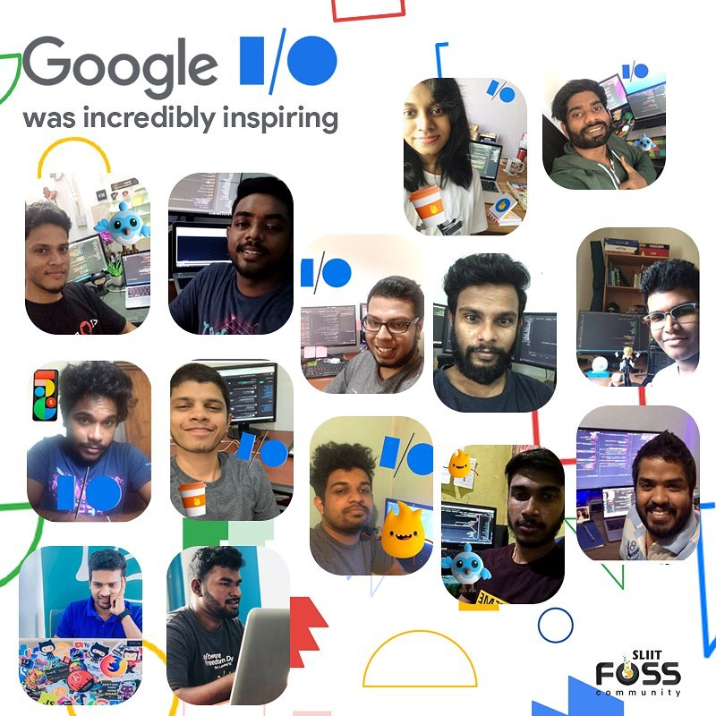
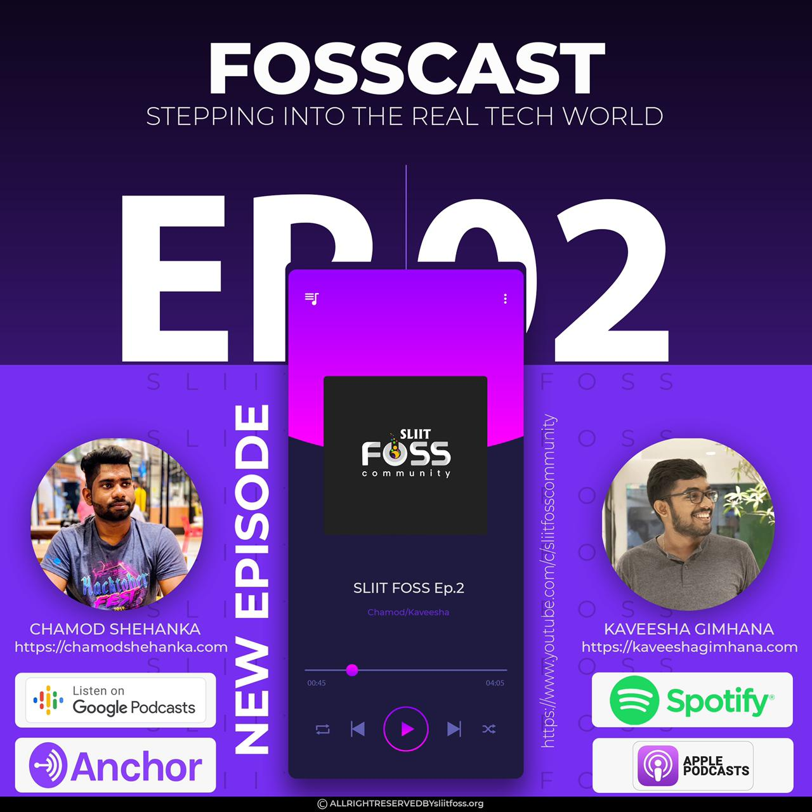

# Hi there! Interested in the SLIIT FOSS Community? :grinning: :computer: 

Here's some FAQs that you might have on your mind 

## 1. Who are we? 

We're a group of Open Source Enthusiasts (and more importantly friends!) who love getting together to create great stuff together or even hangout! Our primary goal is to promote, develop and diversify the usage of Free and Open Source Software at SLIIT!

## 2. What do we do?

Short answer? A lot!

A more detailed answer encompasses many things, we have host events & tech-talks (you can find some here https://sliitfoss.org/events), create stuff together using the latest technologies (like this amazing website we built https://sliitfoss.org/) and also... *drumroll* .... have our very own Podcast! :microphone: (You can listen to it here: https://bit.ly/2VAnrpW) 

## 3. What are the pre-requisites needed to join?

Absolutely nothing! Everyone starts from somewhere so its extremely fair to have people from diverse backgrounds. What matters to us is a willingness to learn and the ability to put time in!

To get started we have some guides that we have setup on getting started. We mainly do stuff revolving around technologies like Git, ReactJS and stuff but these things are pretty easy to get hang of and you can check out our guides here: https://sliit-foss.github.io/zero2hero/

You are also more than welcome to ask any questions from our current members as we are happy to help you out as well!

## 4. Do I have to be a coder to join?

Not really, as a club we face many other hurdles that can't just be solved by throwing a try{}catch{} block at it!

Some of our members take on a variety of other roles but we have dichotomised the roles into Dev, Management and Design :art:. 

## 5. How to join?

If you read all of this, perhaps you might be interested in joining? :eyes:

There's mainly two avenues you can follow

1. If you are still on the fence of joining and just want to be on the sidelines for a moment (which there is no issue of), you can join us on Facebook Group [https://www.facebook.com/sliitfoss/?ref=page_internal](https://www.facebook.com/sliitfoss/?ref=page_internal) and follow us on other Social Media (Linked below :arrow_down:) 

2. If you want to have a more hands-on approach you can actually apply to Volunteer with our club, think of this as a gateway to being an active contributing member to the club in the future, the form can be found here: https://forms.gle/F4NeQ19RDAazdPeQ6

### Links to our Socials:

Facebook: https://www.facebook.com/sliitfoss

Instagram: https://www.instagram.com/sliitfoss

Twitter: https://twitter.com/fosssliit

LinkedIn: https://www.linkedin.com/company/sliit-foss-community
